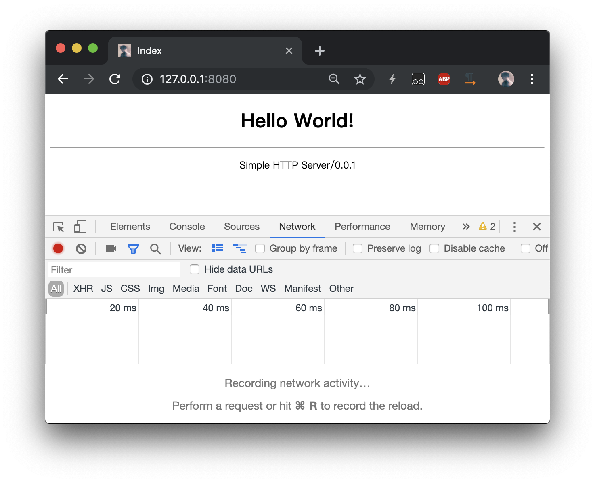
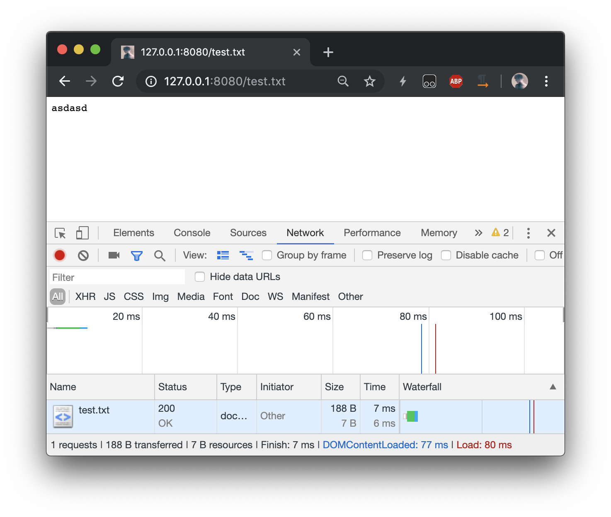
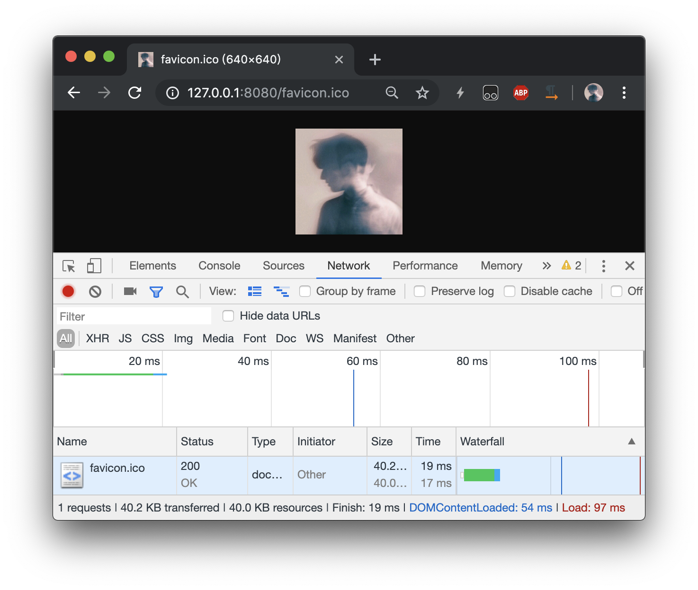
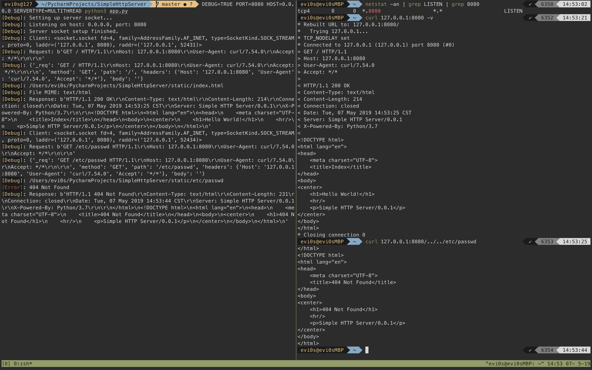
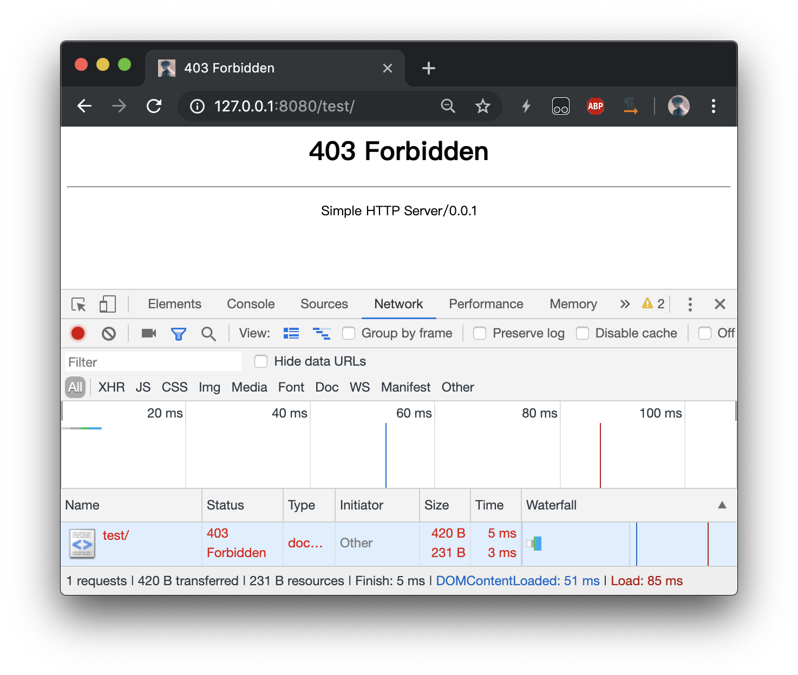
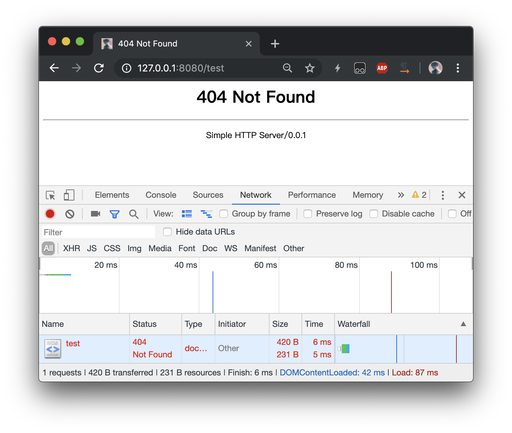
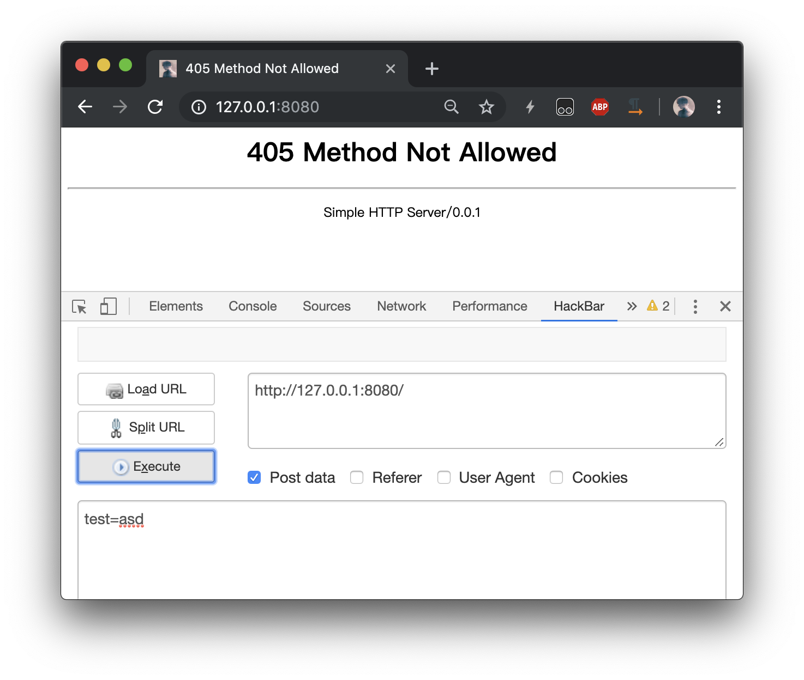
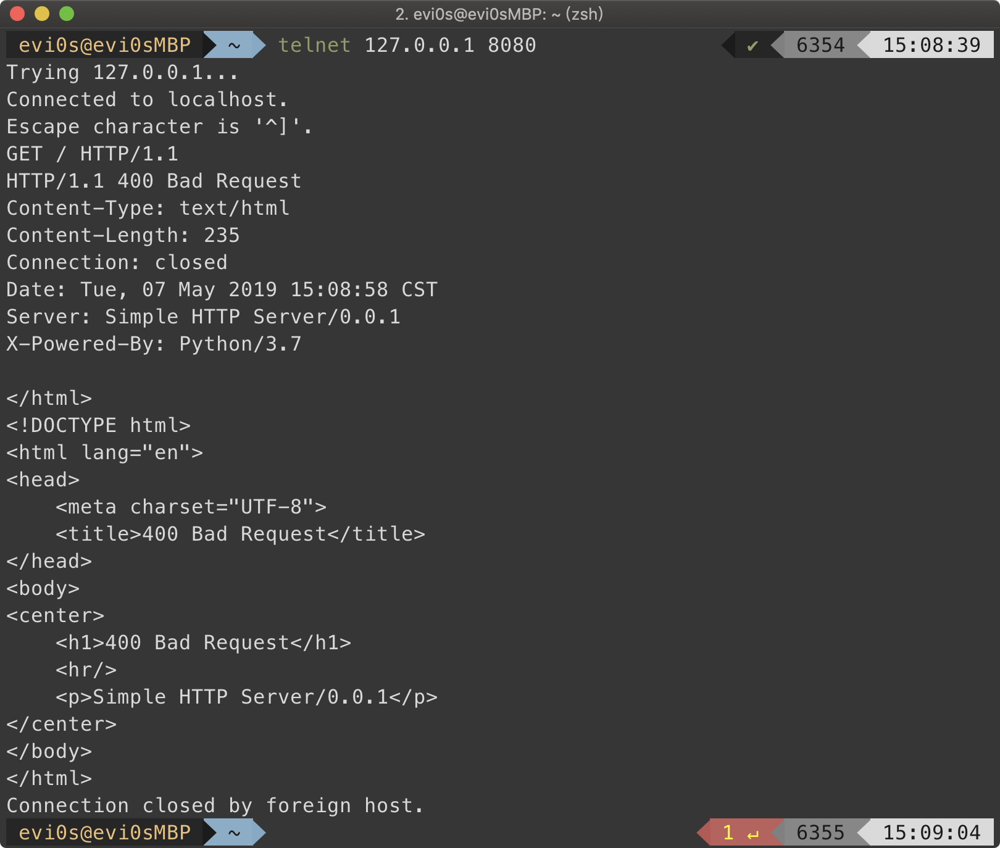

# Simple HTTP Server

计网作业 wsl

## Usage

```bash
python3 app.py
```

Environments

* **HOST** Default `0.0.0.0`
* **PORT** Default `80`
* **DEBUG** Show debug information if `DEBUG` is set
* **STATICDIR** Static file dir
* **ERRORDIR** Error file dir
* **SERVERTYPE**
    - **ASYNC** Async server
    - **MULTITHREAD** Multi thread server
    - **UNBLOCK** Socket unblock server *Default*

## Detailed

### app.py

Entrypoint, which can import specified server and run.

### asyncserver.py

An async socket server using built-in asyncio lib.

See [asyncio](https://docs.python.org/3/library/asyncio.html) for more api details.

### multithreadserver.py

A plain socket server using multi thread to handle client request.

Core code:

```python
# Receive request
client_request = connection_socket.recv(1024)

# Handle request
client_request = str(client_request, encoding='utf-8')
client_response = handle(client_request)

# Send Response
connection_socket.send(client_response)

# Close connection
connection_socket.close()
```

For more detailed information, see code comment & debug info.

### unblockserver.py

Unblock server using socket settings.

```python
server_socket.setblocking(False)
``` 

For more detailed information, see code comment & debug info.

### method handle *handler.handler*

Trying to parse client HTTP request, and get static file. Then initialize a `Response` instance and return response content.

When any exception occurs, return the corresponding response.

### method get_file *handler.handler*

Get file info such as mime types & length, read file and get content.

### method judge_method *handler.handler*

Judge HTTP request method.

Valid method:

* GET
* POST
* OPTION
* HEAD
* PUT
* PATCH
* DELETE

Due to static server, only `GET` is valid. So other method will have a 405 status.

### method error_page *handler.handler*

Return error pages such as 400, 404, etc.

### class Request *handler.Request*

Initialize

```python
Request(raw_request)
```

Get `Request` instance which has path, method, body, headers.

Exceptions will be raised during parsing request if request is malformed.

For more information, see code comments.

#### static method Request.set_method *handler.Request*

```python
set_method(raw_request)
```

return with Request method.

#### static method Request.set_path *handler.Request*

```python
set_path(raw_request)
```

return with Request path.

`../..` like path is not allowed.

#### static method Request.set_body *handler.Request*

```python
set_body(raw_request)
```

return with Request body.

#### static method Request.set_headers *handler.Request*

```python
set_headers(raw_request)
```

return with Request headers which is a dict.

#### method Request.get_request *handler.Request*

```python
Request(raw_request).get_request()
```

return with Request dict.

### class Response *handler.Response*

Initialize

```python
Response(code, message, body, mime, length)
```

Get response string *bytes*

```python
Response().get_response()
```

## Screen shots

### 200 Res



### test.txt



### images



### terminal



### 403 Res



### 404 Res



### 405 Res



### 400 Res

